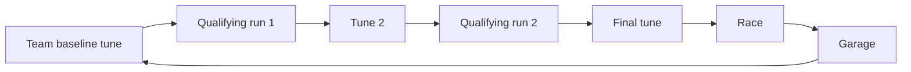

# Race Grid Syndicate Design

As of 2026-09-23.

Race Grid Syndicate is a cyberpunk-vaporwave race team manager: you run a street racing team with guns, mines and armor on dark, neon-lit night circuits, and climb from the underground to the corporate championship.

## Contents

1. [Vision and pillars](#vision-and-pillars)
2. [The player, goals and failure](#the-player-goals-and-failure)
3. [Season structure](#season-structure)
4. [The Night Tune](#the-night-tune)
5. [Qualifying](#qualifying)
6. [The race](#the-race)
7. [Cars: parts, rebuilds and regulations](#cars-parts-rebuilds-and-regulations)
8. [Drivers](#drivers)
9. [Staff](#staff)
10. [HQ upgrades](#hq-upgrades)
11. [Economy](#economy)
12. [Reputation and events](#reputation-and-events)
13. [AI teams and managers](#ai-teams-and-managers)
14. [Art direction and presentation](#art-direction-and-presentation)
15. [Prototype status and open questions](#prototype-status-and-open-questions)

## Vision and pillars

You never drive. You pick drivers, tune cars, make radio calls and manage money, parts and people. The art is chunky, pixelated low-poly models on a semi-abstract isometric city.

**Design rules** (apply to every system):

- **Choose, don't roll.** Randomness lives in what you are offered (pick 1 of 3 cards, sponsor offers, event options) and in the information you get (driver feedback, forecasts), never in the outcome of a choice you made.
- **No nickel-and-diming.** Money only moves on big tickets: new parts, rebuilds, HQ upgrades, driver contracts and staff contracts. Fuel, ammo, repairs and pit stops never touch the ledger; their costs stay inside the race.
- **Arcade combat.** Getting shot damages the car and its parts, never the driver. A wreck is a DNF, not a death.
- **Passive driver abilities.** Drivers have bonuses that switch on by track, situation or session. The player never activates an ability.
- **Contracts can't be broken.** Driver, staff and sponsor deals run to term. Raises are amendments both sides agree to.
- **Tight UI.** Keep padding and panels compact so the race view, driver cards, timing tower and comms all fit on one screen.

## The player, goals and failure

You are the manager of the Syndicate, a street team bankrolled by a shadowy **Backer** who expects a return. A career lasts **10 seasons**; you only win if you do well by the end, and there is no game over before then.

**Goals come in three layers:**

1. **Career (10 seasons):** climb underground → regional → corporate and win the Corporate Grand Circuit. Winning means at least one Grand Circuit title within the 10 seasons (working definition); every career ends with an outcome grade: Legend (2+ titles), Champion (1), Contender (reached the Grand Circuit), Climber (reached the Sprawl League), Stuck.
2. **Backer season objectives:** one **primary** objective set by the Backer, suited to the tier ("finish top 6", "get promoted", "don't finish bottom 3"), plus one **optional** objective you pick from 3 offers ("win with a rookie", "earn 40M QT from sponsors", "finish ahead of Neon Kobra"). Optional objectives pay cash and confidence.
3. **Sponsor placement targets:** money only (see [Economy](#economy)).

**Backer Confidence (0–100)**

| Moves it up | Moves it down |
| --- | --- |
| Objectives met | Objectives missed |
| Promotion | Relegation |
| Profit | Debt |
| Good event choices | Scandal event choices |

- Below 40: the Backer interferes through event cards (forces a sponsor on you, vetoes a big purchase).
- Below 20: an ultimatum season with a single must-hit objective.
- The first season is a lenient honeymoon.

**No game over before season 10**

- There is no takeover or bankruptcy ending: a bad spell costs you, and you keep playing and trying to improve.
- **Out of money:** the Backer covers it with an emergency loan (10% interest, repaid from 30% of cash each season) and confidence drops.
- **Bargain options** keep a broke team on the grid: bargain-bin drivers (skill 33–48), budget staff crews, and patch-job rebuilds (25% of a rebuild's cost, back to only 55% condition). They are cheap and really bad.
- **Relegation** hurts confidence and income but never ends a career.
- After 10 seasons the career ends and you start a new one. **Nothing carries over** between careers.

### The opening

A new career starts from nothing: the Syndicate is the lowest-ranked team in the Gutter Circuit, with the slowest car on the grid, no staff and two empty seats.

1. **Build your crew:** the rivals have already hired from the staff pool; you fill all four roles (Fixer, Crew Chief, Pit Boss, Technical Director) from what's left, the Fixer first (their NERVE bargains down every contract after, drivers included), out of the starting budget (3M QT). You can't afford the best at every role and still develop parts.
2. **Drivers:** a shared pool of 15 free agents (2 stars, 8 journeymen, 2 cheap veterans past their prime, 3 raw rookies). Every rival team has filled one seat from it (the other keeps its own driver), best-ranked team first; the Syndicate, ranked last, signs both its drivers from the 6 left. The list shows every driver in the tier, the rivals' picks included with what they signed for. Star drivers cost steeply more (another 5% a rating point above 65), so the top teams can't take them all. A Fixer with PEOPLE 2+ shows which drivers will grow.
3. **Your first car** and its design meeting (see [Cars](#cars-parts-rebuilds-and-regulations)): this is where the crew you hired first pays off.
4. **The field:** the teams you'll race this season, how each finished the last two seasons (public results; a new career starts with two made-up seasons raced by the teams as they stand, so the pecking order shows), and each rival's car strength as your Fixer reads it. The same screen opens every season, and the garage standings carry the same columns.
5. The season sponsor, the Backer's objectives, the short-term sponsor, then race 1.

**Difficulty target (team standings after season 1):** poor play finishes near last, fine play 8th, amazing play 6th, perfect play 4th. The top three are out of reach in year one; winning takes a few seasons of growth and investment.

## Season structure

Three tiers of 10 teams (30 in total), with calendars of 8, 10 and 12 races; the top 2 teams go up and the bottom 2 go down each season.

| Tier | Name (working) | Feel | Races |
| --- | --- | --- | --- |
| 3 | Gutter Circuit | Underground: mildly simpler tracks that play like the later ones, dirty tricks | 8 |
| 2 | Sprawl League | Regional, semi-legal: mixed tracks, real sponsors appear | 10 |
| 1 | Corporate Grand Circuit | Megacorp-backed: long fast circuits, big money, strict regs | 12 |

Longer calendars at the top mean more money, more part wear and more rebuild decisions. A race weekend takes about 6 minutes, so a season runs roughly 50 minutes (Gutter) to 75 minutes (Grand Circuit).

**Race weekend**

The Night Tune and qualifying are one session: each qualifying flying lap is also the tune's feedback lap. The garage handles rebuilds and new parts between races.

**Tracks and conditions**

- A pool of about 24 circuits (real F1 shapes, see Prototype status), each a city district with **tags** measured from its shape (tight, straights), one landmark and a length. City scenery (water, freeways, landmarks) is atmosphere only: it never crosses the track and never affects the race. Tracks are cheap to make: a curve plus one landmark model.
- Each tier's calendar draws from the pool: tracks get mildly more complex as you climb, but every tier plays the same way (no separate "short street loop" style at the bottom); showpiece circuits sit at the top. Some tracks appear in several tiers with different layouts.
- Race length is set in laps so races run about the same time; tank and tire life are distances, so strategy adapts by itself.
- Night conditions are **forecast** on the calendar when the season is drawn up (shown in the header and the Night Tune title, effects on hover):

| Condition | Odds | Effect |
| --- | --- | --- |
| Clear | 55% | None |
| Acid rain | 20% | Slicks lose 12% grip; WET tires keep it (and overheat on a dry night). Rain Dancer +3% grip |
| Fog | 15% | Gun hit chance −25% |
| Blackout | 10% | The middle sector goes dark: −4% pace there unless the driver has Tunnel Vision |

- Conditions also push one Night Tune target: acid rain pushes handling high, fog weapons low, blackout engine high.

**Points and championships**

- 25-18-15-12-10-8-6-4-2-1 for the top 10.
- **Team championship:** decides promotion, relegation and prize money.
- **Drivers' championship:** builds driver fame and sponsor value.

**Around the calendar**

- **Mid-season:** the rules committee names two parts under regulation review.
- **Off-season:** Backer review and new objectives, promotion and relegation, the regulation change, the driver and staff market, sponsor renewals, HQ upgrades.
- There are **no optional invitational events**.

## The Night Tune

Before each race you tune five setup gauges toward hidden targets, using cards from your crew chief and feedback from your drivers; how close you land decides how much of the car each driver gets on track. The pattern is **initial tune → flying lap → tune → flying lap → final tune**, and the two flying laps are the car's two qualifying runs. It is inspired by Golden Lap's qualifying setup, with a pick-1-of-3 card system instead of dice.

**Gauges and targets**

- Five gauges, each 0–100 and starting at 0: **Engine, Handling, Aero, Weapons, Armor**. These are setup gauges, separate from the four car parts.
- Each gauge has a hidden target between 25 and 90, set by the track and conditions, plus a small per-driver offset, so both cars need their own setup.

**Flow (16 picks per race)**

| Phase | Picks | Notes |
| --- | --- | --- |
| Team baseline | 4 | Before qualifying. Blind and **shared**: each pick applies to both cars |
| Qualifying run 1 | – | The flying lap sets a time and brings radio feedback that narrows where each target is |
| Tune 2 | 3 per car | In the box between runs; the session clock pauses while you pick |
| Qualifying run 2 | – | Second time and second feedback |
| Final tune | 3 per car | The race setup: no lap after this one, then lock in |

- Until a car's tune is locked, it runs on its current gauge settings, so tune 2 shapes run 2's lap time.
- A car can only go out once its picks for the current phase are done. An aborted run gives no feedback.
- If the session ends before a car has run both laps, its remaining phases continue without new feedback.

- **Every pick is a fresh offer of 3 cards** with exact effects, for example *Remap the injectors: +37 ENG, −5 HND*. Rare **Fine Trim** cards give ±4 on a gauge you choose. You can pass a pick.
- **Crew chief skill** (1–5★) raises the chance of a 4th card, cards aimed at what the car needs, fewer drawbacks and Fine Trims.
- **Driver feedback** (the driver's feedback stat) sets how noisy each flying-lap reading is; the Night Owl ability makes it 30% clearer. A low-feedback driver can send you the wrong way.
- **Quick Tune** plays the remaining picks for you.

**Grades**

| Grade | Distance to target | Share of car performance |
| --- | --- | --- |
| S (golden) | ≤ 5 | 100% + golden bonus |
| A | ≤ 10 | 95% |
| B | ≤ 18 | 88% |
| C | ≤ 28 | 80% |
| D | beyond | 70% |

**Golden bonuses**

| Gauge | Bonus |
| --- | --- |
| Engine | +1.5% top speed |
| Handling | Shrugs off the first spin of the race |
| Aero | +2% pace in a slipstream |
| Weapons | +10% hit chance, no jams |
| Armor | First hit each lap does half damage |

All five golden is a **Perfect Tune**. AI cars roll their grades from their manager's tactics rating.

**Special cards.** 5% of cards per crew chief star are specials that work from the hidden targets, so they help and leak information (watch which way things move). Hovering them shows no preview, which would give the target away.

| Card | Effect | What it tells you |
| --- | --- | --- |
| Fine Trim | Every gauge 1 toward its sweet spot | Which side of every target you're on |
| Chief's Hunch | The furthest-off gauge 10 toward its sweet spot | Which gauge was worst, and which way |
| Dyno Run | Nothing moves; the least-known gauge gets a reading worth six flying laps | That gauge's band narrows sharply ("Dyno: Engine reads about 33") |
| Dial It In | The read gauge furthest from your best read is set exactly to it (dealt by the chief's PEOPLE, 2% of cards a star above 1, once something has been read) | Nothing new: it uses what the feedback already says |

**Sweet spot payoff.** On top of each gauge's golden bonus, every golden gauge is worth +1% pace for the race, and a Perfect Tune +3% more (+8% in all). At lock-in each golden gauge turns gold and bursts stars from its target in turn, a banner announces it ("SWEET SPOT BONUS ×3" or "PERFECT TUNE"; the pace figure is in its tooltip), and the Tune window turns gold (shimmering for a Perfect Tune).

**Balance reference:** simulated in `sim/night_tune_sim.py`. With the 4/3/3 structure, an average driver and a 3★ chief land about 1.4 golden gauges per car; an elite chief with an elite driver about 2.2; a Perfect Tune is rare (under 2%).

## Qualifying

Qualifying is a hands-on timed session where timing and traffic decide the grid; weapons are off. It runs inside the Night Tune: each car's two runs are the tune's two flying laps (see above).

- **One session** for everyone (no knockout rounds), about 12 minutes of track time compressed to roughly 75 seconds at 1X.
- For each car you choose **when to send it out** and **which compound** to run. A run is out-lap, flying lap, in-lap. You can abort a lap or stay out for another attempt.
- Each car gets **2 fresh sets** for qualifying (softs or mediums).
- The **track evolves**: later laps are faster, so waiting pays, but going late means more traffic and less time.
- **Traffic** matters: cars on out-laps and in-laps can ruin a flying lap.
- The Night Tune grades apply; the **Qualifier** ability adds pace; racecraft helps in traffic.
- **No tire rule:** every car may start the race on any compound. You choose each car's starting compound on the grid screen, with projected lap life shown.

## The race

The race is watched on a semi-abstract isometric view while you manage through radio orders, pit calls and driver cards.

**Radio orders** (per driver, change any time). On the driver cards each option is a colored button, blue = conserve, yellow = standard, red = push, with a tooltip saying exactly what it does.

| Order | Options | Effect |
| --- | --- | --- |
| Fuel | LEAN / STD / RICH | RICH is 5% faster and burns 30% more; LEAN is 3% slower and burns 20% less |
| Tires | SAVE / STD / PUSH | PUSH gives 6% grip and 70% more wear; SAVE gives up 5% grip for 40% less wear |
| Guns | HOLD / STD / FREE | FREE fires about 60% more often, less accurately; HOLD saves ammo |

**Fuel and tires**

- Tank range and tire life are distances. On STD a full tank lasts about 5.2 laps of the reference circuit and a set of mediums about 6.7 laps, so lap count drives stop count.
- A full tank does not reach the flag on STD in a standard race: run LEAN all race, or plan a stop.
- Worn tires cost corner speed (grip falls toward 60% at zero).

**Tire compounds**

| Compound | Grip | Wear | Life (reference) |
| --- | --- | --- | --- |
| Soft | +6% | 1.8× | about 3.4 laps |
| Medium | baseline | 1× | about 6 laps |
| Hard | −5% | 0.6× | about 10 laps |

Compounds stack with tire orders, the driver's tire stat and Tire Whisperer. A wet compound comes with acid-rain nights.

**Pit stops**

- The pit lane runs beside the start/finish straight, with a box per team and a speed limiter.
- Each driver card has a PIT row: FUEL (on/off), a compound picker (MED → SOFT → HARD → NO TIRES) and BOX (come in next lap).
- Refueling adds enough to reach the flag on RICH, so a stop buys the right to push. Service time is about 1s plus fuel time plus 1.5s for tires.
- Cars in the pit lane can't shoot, be shot or hit mines.

**Weapons (kept simple)**

- One gun per car that fires 3-round bursts at the car ahead, from a 90-round magazine; hit chance depends on the guns order, the weapons part, the Night Tune grade and the driver's gunnery.
- Mines: most teams carry 1, dropped when a car is close behind. A hit spins the car and damages the chassis.
- Body plating reduces incoming damage. Hits damage armor and a part (mostly the body). At zero armor the car is wrecked (DNF).

**Race info**

- Driver cards: position, lap, speed, armor, tires (with compound), fuel (with a tick showing fuel at the flag), rounds, part condition, tune grades, stats and ability chips that light up when active.
- The timing tower shows gaps, compounds and durability; the comms feed carries radio calls and race events.

## Cars: parts, rebuilds and regulations

Each car has four parts that wear every race; between races you choose to leave a part, rebuild it or develop a new one, and each season a rule change can mute a part that was pushed too far.

**Parts**

| Part | Affects |
| --- | --- |
| Engine | Top speed and acceleration |
| Chassis | Grip and cornering |
| Body | Armor plating (damage taken) and bodywork aero (some speed and grip) |
| Weapons | Hit chance; worn weapons jam |

- The team develops a **level** per part; each car's copy has its own **condition**.
- Condition falls every lap (about 10–15% a race): RICH works the engine, PUSH works the chassis, firing wears the weapons, gunfire mostly hits the body, mines hit the chassis.
- Below 20% a part can fail: an engine or chassis failure ends the race; a body failure costs 20% grip and adds 30% damage taken.

**Garage decisions (between races)**

- **Rebuild:** re-machine or recast the whole part. Costs 60% of a new part at that level and restores full condition, same level.
- **Develop new:** BUILD opens **three design cards, one per style**, each with a level 1-5 drawn from the Technical Director's DESIGN (the design meeting's curve at its STANDARD spread; nothing widens it): **PERFORMANCE** +(5 + level) levels, a race slower, arrives at 80% condition; **QUICK** +(3 + level), a race faster (min 1), 90%; **ROBUST** +(4 + level), on time, 100%. The Technical Director's MECHANICAL sets the base build time (3 races, 2 at 4+). A part's three cards are dealt once and kept until one is built (backing out never re-deals); a new Technical Director or a new season deals fresh ones. Catch-up and the level-3 Machine Shop bonus add on top. AI managers get the same cards (rookies pick at random, pros and elites weigh the jump against time and condition). Price rises steeply with level.
- These are decisions, not automatic bills, which keeps the no-nickel-and-diming rule.

**A new car every season**

- At season end every team's parts **decay toward the base level of the tier it races in next season**: new level = base + share × (end-of-season level − base), plus anything its Design Studio banked. The share is the Technical Director's DESIGN: 30% → 70% (+10% a point); the regulated part keeps half that; a part below the base (usually after a promotion) carries 40% of the shortfall, so it's pulled most of the way up. Over-investing in parts during a season is allowed and partly carries over.
- Developments still in progress finish before the reset. A relegated team decays toward the lower base from its higher levels, so it usually arrives strong and can bounce back; a promoted team decays toward the higher base, usually from below, so it starts near the new base, behind the established teams. **A promoted team gets a league grant of the new tier's money** (2.00M QT into the Sprawl League, 3.50M into the Corporate Grand Circuit), AI teams included.
- **NEW CAR** shows each part's new level and where it came from (base, carried, studio) against the field.

**Regulation changes**

- Mid-season, the rules committee names **2 parts under review**. At season end one of them gets new regulations, each with a fictional name: *Flux-limiter mandate* (engine), *Crash-cell standard* (chassis), *Bodywork homologation* (body), *Ordnance treaty* (weapons).
- **The regulated part keeps half the usual share** of its level above the base in the new car. Over-developing a part under review is a visible gamble.

**The design meeting** (after NEW CAR, every season and at a career start)

- First choose how hard to push: **SAFE** (3 picks, every part starts the season at 100% condition, card quality consistent), **STANDARD** (4 picks, 85%, varied) or **EXPERIMENTAL** (5 picks, 70%, unpredictable).
- **Who pitches, per pick:** 2 cards from the **Technical Director**, 1 each from the Crew Chief, Pit Boss and Fixer (if hired), +1 with a level-3 Design Studio (the Technical Director's work). Up to 6 options.
- **Every card has a level, 1 to 5, shown on the card** (rolled when dealt, never after you pick). The level sets the numbers: one part +(2 + level), 3 → 7; two parts +2/+2/+3/+3/+4 each; or a trade, one part +(4 + level), 5 → 9, and another −2.
- **The pitcher's MECHANICAL sets the odds**, whatever their role: levels average 1.6 at MECHANICAL 1 → 4.4 at 5 (+0.7 a point), and any level can come from anyone (a beta curve plus a 5% even floor). How hard you push only widens or tightens the curve; the average stays put. At MECHANICAL 3: SAFE 2/22/52/22/2%, STANDARD 5/26/38/26/5%, EXPERIMENTAL 12/24/27/24/13% for levels 1-5.
- AI teams hold the same meeting: elite managers push EXPERIMENTAL when they can afford the rebuilds, pros go STANDARD, rookies pick at random.

**Next-year projects** (the Design Studio): pay now (0.6M QT × tier money) for a part type; after 3 races the project banks +(3 + ½ DESIGN) levels onto next season's car. It does nothing this season. AI managers with cash to spare do the same (elites up to 2 at once, pros 1, rookies never).

## Drivers

Drivers are base stats plus zero to three passive abilities, with morale that moves over a season and raise demands when they win.

**Stats** (40–95, 70 is average)

| Stat | Affects |
| --- | --- |
| Pace | Top speed and grip |
| Racecraft | How easily they pass, how fast they change line, squeezing past weaker racers |
| Tires | Tire wear |
| Fuel | Fuel burn |
| Gunnery | Hit chance |
| Composure | Damage taken, spin length |
| Feedback | Night Tune reading accuracy |
| Fame | Sponsor value, raise demands |

**Abilities** (passive, 0–3 per driver; 0 is common, 3 is rare, stronger drivers skew higher)

| Ability | Bonus |
| --- | --- |
| Street Rat | +12% grip in slow corners and the braking into them (cyan trail) |
| Boulevard King | +4% top speed on straights (pink trail) |
| Tunnel Vision | No pace loss in the dark sector on a blackout night (others lose 4%; purple trail) |
| Hunter | +2% pace and +10% hit chance close behind a car |
| Wall | Much harder to pass |
| Front-Runner | +1.5% pace in the top 3 |
| Comeback Kid | +1% pace and better overtaking outside the top 10 |
| Cool Under Fire | 25% less gunfire damage |
| Closer | +3% pace on the final lap |
| Rocket Start | +8% pace and acceleration for the first 10 seconds |
| Pit Whisperer | Pit stops 30% shorter |
| Tire Whisperer | 35% less tire wear on PUSH |
| Fuel Miser | 15% less burn on LEAN, and LEAN costs half the pace |
| Deadeye | No jams, +5% hit chance |
| Night Owl | 30% clearer Night Tune feedback |
| Qualifier | Extra pace in qualifying |
| Rain Dancer | +10% grip on acid-rain nights (blue trail in corners) |

Track abilities work in zones measured from the track's shape (slow corners, straights, dark sectors), not from tags, and leave a trail in their colour while they boost the car. The ability lab (`tools/ability-lab.js`) measures what each is worth: Street Rat saves about 2.5% of a lap on Monaco-shaped Hong Kong and 0.5% on Monza-shaped New York; Boulevard King the reverse (0.4% and 2.3%). Real-shaped tracks corner with realistic grip (GRIP_M) so their corners play like the originals.

**Morale (0–100)**

- Starts around 60 and drifts back toward it. High morale gives small pace and composure boosts; low morale small penalties; very low morale means the driver won't extend.

| Raises morale | Lowers morale |
| --- | --- |
| Win +12, podium +8, points +3 | DNF from a part failure −10 |
| Beating their expected finish +2 | DNF from combat −4 |
| Lounge upgrades; the crew chief's PEOPLE (resting level) | Wrecked by a rival −6, mine hit −2 |
| The fixer's NERVE softens the hits; payback at NERVE 4+ turns being wrecked by a rival into +2/+4 | Finishing well below expectations −3 |
| | Starting with neglected parts (below 30%) −3 |

A good tune adds no morale of its own: it already pays in pace and results.

**Raises**

- Wins and podiums raise fame, and a driver with rising fame demands a raise through an event card:
  - **Pay:** a big-ticket salary increase for the rest of the contract, morale up.
  - **Refuse:** a large morale drop; they won't extend.
  - **Promise for next season:** a small morale drop now, the raise locked in at renewal.
- Success costs money: keeping a star happy strains the budget, which pushes back against runaway teams.

**No rivalry.** Teammates don't feud; morale comes from results and race events.

**Market and contracts**

- Drivers improve while young (under 24), peak, then decline (34+), with a hidden per-driver talent factor. They retire at 38; about 6 new drivers arrive each year.
- Contracts run 1–3 seasons at a salary fixed on signing and can't be broken. Drivers are always the most expensive contracts.
- The Fixer (staff) shows true trajectories; good drivers go early.

## Staff

Staff come from **one persistent world pool** (about 140 people across the three tiers), shared by every team. Contracts run 1–3 seasons; each staffer brings their own crew. Contracts are big, but drivers are always bigger. A new career starts with all four roles open (see [The opening](#the-opening)).

**Skills, not roles.** Everyone has four skills rated 1–5, and anyone can fill any role. Each role uses two skills, every skill is used by exactly two roles, and each skill drives its own effect in each role, so a lopsided specialist in the right seat is worth finding:

| Role | Skill | Effect (skill 1 → 5) |
| --- | --- | --- |
| **Crew Chief** (race day) | DESIGN | Night Tune cards aimed at what the car needs 10% → 70%; chance of a 4th card 0% → 60%; sweet spot within 5 → 7 of the target; +1 final-tune pick at 4+ |
| | PEOPLE | Driver feedback noise +8% → −22%; DIAL IT IN cards 0% → 8% of cards once there's feedback (set a gauge to your best read); morale's resting level +0 → +8 |
| **Pit Boss** (race day) | NERVE | Pit stops take 103% → 73% of normal time |
| | MECHANICAL | Part wear in races 0% → −24%; each stop patches the most worn part +5% → +25% condition; their design-meeting card's level |
| **Technical Director** (strategic) | DESIGN | New-part design cards average level 1.6 → 4.4; keeps 30% → 70% of each part's level above the base into next season; sizes Design Studio projects |
| | MECHANICAL | New parts ready in 3 → 2 races; design-meeting card levels (see the design meeting) |
| **Fixer** (strategic) | PEOPLE | Sponsor offers +0% → +20% (a 4th offer at 4+); driver scouting (growth arrows at 2+, a 4th market candidate at 4+); rival car reads ±10 → ±1.5 (every rival part is known only as a range, and "vs field" figures carry the same uncertainty) |
| | NERVE | Contracts (drivers, staff, raises) −0% → −20% when signed; keeps the heat off your drivers: morale hits 0% → −32% softer (the garage's morale breakdown credits it); after a race makes a bad night pay: a driver wrecked by a rival wants payback at 4+ (the −6 becomes +2, +4 at 5), the part that failed and put a car out is patched by its supplier (+20% condition a star), and a rival who wrecked your car pays damages if their fixer's NERVE is below yours (0.05M × tier money a point of gap; a tougher fixer laughs it off and yours learns their NERVE); event and fixer-deal costs −0% → −40%; unlocks the fixer's dirty deals (3+) and the dirtiest (4+) |

A vacant role works like skill 1. Salary follows someone's top two skills (the top one counts most), so a specialist costs about the same as an all-rounder of the same level.

**The pool over time.** Contracts that end send people back to the pool; everyone ages and their skills drift (the young improve, the old fade); veterans retire; about 8 newcomers arrive each season. At every season start the **rival teams hire first** (higher tiers first, then by last season's standings); at a career start your tier's rivals hire in pecking-order order, a round per role, so the best team can't take all four of the best people.

Off-role skills can matter too: every crew member's MECHANICAL sets the level of the design-meeting card they pitch (shown in their tooltip).

**Screens.** CREW shows your four roles (who's in each, or HIRE on an open one). The Fixer's seat is settled first (hired or left vacant), since their NERVE bargains down every contract after; then the rest in any order. AI teams hire their fixer first too. HIRE opens that role's list: everyone working in your tier (rivals' staff dimmed, with their team and salary, so you can see who's spending) plus the free agents, sorted by fit, with an AVAILABLE filter. Anyone can be hired; the contract cost is the only limit. (Later idea: top staff prefer to work at great shops, and a room like Crew Quarters could raise a lesser-known shop's appeal.)

**AI teams run on real staff:** their Technical Director sets how far and how fast their parts develop, their Crew Chief deals their Night Tune cards and reads their drivers (they play the same Night Tune you do), their Pit Boss sets their stop times and wear, their Fixer shapes their sponsor offers and brings them deals. Their manager's rating decides how well they pick (rookies chase one flashy skill, pros hire for fit, elites for fit per QT).

## HQ upgrades

The HQ starts as a back-alley chop shop and grows into a neon penthouse. Every building has 3 levels (1 / 2 / 4M QT) that unlock options rather than discounts. The HQ screen shows the rooms and the test facilities as two sections.

**Rooms**

| Room | Unlocks |
| --- | --- |
| Machine Shop | Parts in development at once (1 → 2 → 3); level 3: every new part arrives +1 level |
| Design Studio | Next-year projects at once (1 → 2 → 3); level 3: one more option at every design-meeting pick |
| Sim Rig | Level 1: an extra team-baseline pick. Level 2: the crew chief's cards aim better. Level 3: an extra qualifying set |
| Data Den | Rival intel (tune grades, manager ratings); level 3 reveals which part the regulation change will hit |
| Lounge | Driver morale drifts higher, softer hits, a morale floor |
| Street Front / Corporate Suite | Pick one path: amplifies Street Cred or Corporate Standing |

**Test facilities** (one per Night Tune gauge): each level starts its gauge higher at every Night Tune, 0 → 8 → 16 → 24. Hidden targets never sit below 25, so it's always a head start.

| Facility | Gauge |
| --- | --- |
| Dyno Cell | Engine |
| Suspension Rig | Handling |
| Wind Tunnel | Aero |
| Firing Range | Weapons |
| Crash Bay | Armor |

AI teams have no HQ; they roll their Night Tune grades from their manager's tactics and their crew chief.

## Economy

The currency is the **quint-token (QT)**, counted in millions; money comes in from sponsors and prize money and goes out only on big tickets.

**Money in**

- Sponsor fees, every race.
- Sponsor placement bonuses: the season sponsor's at season end, the short-term sponsor's race by race.
- Prize money per race by finishing position (small next to sponsors).

**Money out (big tickets only)**

- Driver contracts and staff contracts, paid once per season (and raises).
- New part development and rebuilds.
- HQ upgrades.
- Emergency loan repayments to the Backer, if you default.

**Sponsors**

Two sponsors, each a fee every race plus a bonus for hitting a placement target. Each slot offers 3 deals that run from an easy target with a small bonus and a bigger fee to a hard target with a big bonus and a small fee. Offers show only their terms (fee, target, bonus, length), with no labels or hints about how likely you are to hit them: predicting how well you'll do is part of the skill.

| | Season sponsor | Short-term sponsor |
| --- | --- | --- |
| Length | One season | 1–4 races (never past the season's end) |
| Bonus | At season end, for the final team placement ("top 5 in the team standings") | Every race one of your cars finishes at or above the target ("a car P9 or better") |
| Offers | At a season start | Before the Night Tune whenever the slot is free; leaving it empty skips one race |
| Also | Its color goes on your cars | |

- Sponsors set targets from your reputation: they expect your team at a place (rep 30 → about P7) and your best car at about twice that minus one. The easy target sits 2 team places (4 car places) below that, the hard one 2 (4) above. None of this is shown to the player.
- Offers are priced so all three are worth the same at the sponsor's own odds (90% / 65% / 45%), with a premium for risk (up to +15%). The choice is a bet on whether you'll beat what your reputation says.
- Street brands price from Street Cred, corporate brands from Corporate Standing. Deals can't be broken.

**Keeping it fair (tuned with autoplay careers)**

- **The same economy for everyone.** Each AI team has a reputation that follows its standings like yours and signs real sponsor deals: its manager picks from the same offers (rookies grab the biggest guaranteed pay, pros and elites weigh the bonus, elites read their own chances; business rating scales offers ±10% in place of a Fixer), is paid per race and collects objective bonuses at season end. Teams off your tier hold no deals. An explicit AI cheat-cash knob exists (off) in case the game needs to be harder. AI teams pay driver salaries and a staff bill each season, and their garages have development slots (2, or 3 for an elite business manager).
- **Parts are relative.** A part's performance comes from its lead over the field median, easing off past about 10 levels and capped near ±5%. New parts cost 7% more for every level ahead of the field, so falling behind is cheap to fix and running away is expensive.
- **Catch-up development.** A new part that's behind the field median arrives 40% of that gap better on top of its usual step (copying the leaders is easier than out-thinking them). It applies to every team and fades as a team catches up; without it, one development per part in a season can't close a starting deficit.
- **Tiers are anchored.** At season end your tier is re-centered on its base level, so development inflation doesn't carry you into a tier that was simulated off-screen.
- **Bounded rewards.** A bet-on-yourself sponsor deal pays at most about 2× its value; prize money is small next to sponsors; raises stop at a driver's market value.
- Reference run (autoplay, 8 careers, a manager policy that fills livery slots with sensible deals, buys the Machine Shop early and develops parts): 1 STUCK, 2 CLIMBER, 4 CONTENDER, 1 LEGEND. Parts leads stay within about ±20 levels and your income tracks the AI teams' in each tier. The policy's sponsor and HQ choices swing results most.

**Balance reference:** simulated in `sim/season_econ_sim.py` (10 teams, 6 seasons, driver market, multi-season contracts, parts and events). Business and tactics skill both matter: going from rookie to elite business is worth about 2.7 championship places for the player, tactics about 3.6. Contract costs in the sim (M QT per season):

| Skill | Driver | Staff crew |
| --- | --- | --- |
| 60 | 2.1 | 0.6 |
| 80 | 9.0 | 2.1 |
| 95 | 26.6 | 4.9 |

## Reputation and events

Reputation has two tracks, **Street Cred** and **Corporate Standing**, and event choices often trade one for the other so your team drifts toward street or corporate.

| | Street Cred | Corporate Standing |
| --- | --- | --- |
| Rises with | Wins in lower tiers, aggressive racing, Fixer and black-market choices | Clean results, the season sponsor's target met, no scandals |
| Unlocks | Underground sponsors (big bonuses, odd objectives), street-racer drivers, Fixer deals | Megacorp sponsors (big guaranteed pay), better terms in the top tier |

Backer Confidence is separate from both.

**Events**

- Business events land between races. Each offers 2 options with known outcomes; you pick one.
- Examples: a sponsor publicity stunt the night before a race, a black-market part, a garage fire, an investor wanting a cut of prize money, a rival poaching your crew chief, driver raise demands, Backer interference.
- The event catalog is still to be written (7 placeholders exist).

**The Fixer's calls**

Events are things that happen to you; the fixer brings you deals nobody else would. The rules are the same for every team. After a race (after any event card) your fixer may call: one screen, take one deal or pass. Rival fixers call their teams too, and their managers answer by business rating (rookies take the first deal they can afford, pros and elites the best value over its price, keeping a reserve). Outcomes are stated on the deal; a bet or a dive pays on a stated race result, like a sponsor objective. Running deals show on the hub's FIXER DEALS card and end with the season.

- **PEOPLE is who they know:** the chance of a call after each race (25% at 1 → 85% at 5), deals per call (1, 2 at 3+, 3 at 5) and the connected deals (3+). No fixer, no calls.
- **NERVE is how dirty they'll go:** dirty deals at 3+, the dirtiest at 4+, and every price down with the event discount.
- No deal comes up twice in a row; none come after the last race.

| Tier | Deal | What it does |
| --- | --- | --- |
| Clean | Tune sheet | Next race: precise readings on 2 gauges before the baseline |
| | Borrowed facility | Next race: your weakest test facility's gauge starts as if it were level 3 |
| | Scrapped prototype | A spare part at your best level +5, 40% condition |
| | Collector | Sell every spare you aren't running |
| | Block party / PR firm | +5 to whichever reputation track is lower |
| | Side bet | Stake now; 3× back if your best car beats both of the rival just above you |
| Connected | Committee aide | Learn which reviewed part gets new regulations (what a level-3 Data Den shows) |
| | Corporate test program | One part +5 levels on both cars for 3 races, then it goes back; Corporate Standing +2 |
| | Freelancer | One race-day skill (pit NERVE or MECHANICAL, chief DESIGN or PEOPLE) works as a 5 for 2 races |
| Dirty | Take a dive | Paid if the rival just above you beats both your cars next race; Corporate Standing −3 if paid |
| | Stolen blueprints | Next season's car +4 levels in one part; Street Cred +2, Corporate Standing −4 |
| | Arms cache | +2 mines per car for 3 races; Street Cred +2 |
| | Dossier | Learn every rival fixer's NERVE for the season |
| Dirty (attack) | Dirt file | A rival you pick: Corporate Standing −3 per point of NERVE gap (up to −9) |
| Dirtiest (attack) | Pit crew bribe | A rival you pick: +1 s per stop next race per point of gap (up to +4 s) |
| | Garage job | A rival you pick: their best part −1 level per point of gap (up to −3) |

**Attacks and protection.** An attack names the rival you choose and only works on a fixer with less NERVE than yours; the gap sets how hard it hits. A fixer with as much NERVE (or more) shuts it down: the attacker has paid, loses 4 Corporate Standing, and each side learns the other's NERVE for the season. The outcome is fixed by facts you can know, so the edge is knowing who's soft:

- Every rival fixer's NERVE shows on the field screen and the standings as your fixer reads it: a range that always holds the truth, 5 wide with no fixer, 3 at PEOPLE 1, 2 at 2–3, 1 at 4, exact at 5. It stays the same all season.
- A dossier, or any move that gets shut down (yours or theirs), makes a read exact.
- Picking a target shows each rival's read and what it means for this move: WORKS (with the hit), MAYBE or SHUT DOWN.
- You hear what was aimed at you: a bribed pit crew, a wrecked part, a story, or a move your fixer shut down (and who tried).
- AI managers play by the same rules: rookies go for the team just above them blind; pros and elites only for a rival their own fixer reads as surely softer.

Deals that deal in pieces (scrapped prototype, collector) are yours only, since AI teams keep one shared level per part. A rival's bet, dive or bribe is aimed at the team just above it, which can be you: once you have a fixer, the FIXER DEALS card shows what's running against you (a bribed pit crew, a rival taking money to lose to you).

## AI teams and managers

There are 30 teams, 10 per tier, with 2 cars each; every AI team is run by an AI manager with two ratings, business and tactics. Some team styles:

| Team | Style |
| --- | --- |
| Syndicate | You |
| Neon Kobra | Stretch strategy, guns FREE |
| Chrome Jackals | Standard strategy |
| Hexadyne | Attack: RICH/PUSH, more stops |
| Crimson Ronin | Gunslingers, lighter armor |
| Azure Dynamics | Slightly quicker, standard strategy |
| Gilt Vipers | Rich corporate team: fast, armored, attack strategy |
| Void Cult | Mine specialists |
| Tidewater | Fewest stops, fragile |
| Ghostline | Never shoot, pure pace on attack strategy |

- **AI managers** are the rival counterparts of the player, not hires, and cost nothing (their teams do pay drivers and staff). Each is rated rookie, pro or elite on:
  - **Business:** sponsor picks, budget split, market timing, rebuild and development calls, event choices.
  - **Tactics:** Night Tune grades and race pace.
- Managers are assigned randomly (within their team's pecking-order group, below) and change **only through events** (poached, retired, scandal). There is no automatic sacking.

**Pecking order.** Every career starts from the same fixed order, which then changes through play. Each team's group sets its starting parts (against the tier's base level), driver quality, cash, reputation and manager ratings:

| Group | Gutter Circuit | Sprawl League | Corporate Grand Circuit | Parts | Managers |
| --- | --- | --- | --- | --- | --- |
| Top | Tin Saints, Block 9, Glitch Gang | Skyline Runners, Ironveil, Neon Kobra | Gilt Vipers, Apex Meridian, Azure Dynamics | +5 | pro or elite |
| Upper-mid | Scrapheap, Alley Cats | Crimson Ronin, Void Cult | Lumen Systems, Kronos Heavy | +2 | random |
| Lower-mid | Sewer Kings, Dust Devils | Halo Drift, Static Pulse | Zenith Arms, Chrome Jackals | 0 | random |
| Backmarkers | Rust Rats, Neon Roaches | Tidewater, Nightshift, Red Harbor | Hexadyne, Ghostline, Orbital City | −2 | rookie |
| You | Syndicate | | | −5 | you |

## Art direction and presentation

The look is chunky, pixelated low-poly models on a dark, semi-abstract isometric city, where the track and the cars carry all the neon.

- **Pipeline:** simple box-and-cylinder models rendered live through a banded "pixel" shader with a black outline pass, at low resolution, scaled up with hard pixels (see `prototypes/Sprite Forge.html`). Cars snap to 16 headings; the camera snaps to whole pixels.
- **City:** only hints around the track: canal, elevated freeway, one landmark per track. Anything in front of a car gets a checkerboard fade.
- **Views:** full track, follow car 1, follow car 2, with the other two views as picture-in-picture.
- **Labels:** position tags over cars; rivals' tags drop to a single pixel when crowded, yours always show.
- **Layout:** the race view fills the window, driver cards dock along the bottom, the timing tower and comms sit on the right; phones stack.

### Sound

- **Music:** synthesized live from public-domain scores. Darksynth while cars are on track, Chill in the office screens and before the start.
- **Sound effects stay sparse.** There is no engine or tire drone; the music carries the energy. Sounds mark the moments that matter, almost all of them for **your** cars:
  - the race title card whooshing in and out, the start lights and lights out, the last-lap bell and the chequered flag;
  - your gunfire and the hits you take, armor warnings, mines, spins, wrecks and part failures;
  - engines: your cars launching at lights out and revving away from the pit box;
  - pit stops, places gained (and two or more lost), and a radio blip on comms;
  - qualifying runs and lap times, Night Tune picks and locks;
  - in the office: button thuds, money in and out, contracts stamped, garage work, and season-end stingers (promotion, relegation).
- **Rivals** are silent except for a distant thud when one wrecks.
- **Two styles:** interface, radio and info sounds are synth sounds in the music's voice. Physical sounds (guns, impacts, explosions, the pit air gun) are CC0 recordings, softened with a little lowpass and drive so they sit with the pixel look.
- **Controls:** the SOUND button opens separate Music and SFX volume sliders; M mutes everything.

## Prototype status and open questions

**Built** in `game/` (run `./play.sh`; code layout in `docs/ARCHITECTURE.md`):

- Isometric race with 20 cars, radio orders, fuel, tires and compounds, pit stops, combat and mines.
- Parts, wear and failures, the between-race garage, regulation changes.
- Three tiers of 10 teams (8/10/12 races, 2 up / 2 down, other tiers simulated), a Backer-graded 10-season career.
- **Every track is a city circuit shaped like a real F1 track** (25): Victoria Harbour Streets (Hong Kong, from Monaco), Marina Nightline (Singapore, Marina Bay), Shinjuku Spiral (Tokyo, Shanghai), Rain City Ring (Seattle, Spa; rains most), Five Boroughs Speedway (New York, Monza), Neon Strip (Las Vegas, Las Vegas), Motor City Drop (Detroit, Red Bull Ring), Mirage Circuit (Dubai, Bahrain), Amstel Bank (Amsterdam, Zandvoort), Gangnam Twist (Seoul, Hungaroring), Lagoon Island Run (Lagos, Montreal), Monsoon Bowl (Mumbai, Interlagos), Thames Barrier Circuit (London, Silverstone), Spree Nights (Berlin, Barcelona), Citadel Streets (Cairo, Baku), Sunset Interchange (Los Angeles, Mexico City), Copacabana Rush (Rio, Jeddah), Vltava Ring (Prague, Imola), Lakeshore Grand (Chicago, COTA), Chao Phraya Circuit (Bangkok, Istanbul), Batavia Docks (Jakarta, Sepang), Sunburn Speedway (Phoenix, Losail), Fog City Coaster (San Francisco, Algarve), Opal Park Circuit (Sydney, Albert Park) and Malecon Neon (Havana, Miami). `sim/build_tracks.py` builds them from the MIT-licensed outlines at github.com/bacinger/f1-circuits: same shape (corner count, chicanes, straight share and direction all match the real circuit, measured with `sim/track_metrics.py`), shrunk to game size. A physics scale makes each shrunk corner behave as if full size, so the lap keeps its real rhythm. Close passes are nudged apart; tracks never cross themselves (so no figure-eights: Suzuka is out). Shrunk hairpins are tighter than the road is wide, so the drawn road edge is clipped to a sharp apex there (drawing only; the sim corners on the true shape). `tools/kink-check.js` checks every track for edges that fold or spike. Water is a caricature of the city's real water where a sketch exists (`game/js/data/waters.js`: Amsterdam's canal rings, the Thames, Dubai's Palm...), otherwise a coast, lake, river or canals from the dressing sheet; it is placed beside the circuit, pushed clear of the road and pits, and a verge under the road keeps it dry. Freeways are a small elevated network per city (`game/js/world/freeways.js`, style from the sheet's road column): a freeway with a branch and an exit ramp, a stack interchange with a flyover and connector ramps (Los Angeles, Tokyo, Phoenix), a viaduct along the water's edge (Hong Kong, Chicago's lakeshore, Havana's Malecon...) or a freeway striking out across the river or bay. They hug the circuit at a safe distance without ever crossing it, and their free ends come down to ground on ramps just past the circuit rather than running off the map. Lit decks, orange rails, streetlights, shadows and moving traffic. Each city has a recognisable landmark built from simple shapes (Space Needle, Berlin TV tower, the pyramids, a hilltop statue, the opera house sails, a suspension bridge over the bay...), placed by a rule: in the infield, on the shore, away from the water, or out over the water, always clear of the road, pits, freeway and water. The pit lane goes on whichever side is outside the loop.
- **Tiers mix track types.** Every tier's pool mixes power, flowing and tight circuits, so every ability and tuning style matters from season 1; early tiers are only mildly simpler because the extreme circuits (Monaco, Marina Bay, Jeddah, Imola, Miami) are held back for the top. Pools overlap between neighbouring tiers (Gutter 11, Sprawl 13, Corporate 13), and each season's calendar rotates through its tier's pool, so some circuits sit a season out. The twelve original hand-built tracks (fast-sweeper loops that didn't play like the real shapes) are gone. Race length is set in reference laps of 457 units (`CANAL_LAP`, the retired Canal District's length) and converted per track; tank range and tire life are distances, and tires wear faster on twistier tracks (corner load is compared with a fixed `REF_LOAD`, the Canal's).
- Driver stats and abilities, the Night Tune, hands-on qualifying, driver morale and raise demands (with placeholder season salaries), AI managers.
- Sponsors: a season sponsor (final team placement bonus, its color on your cars) and a short-term sponsor (1–4 races, per-race placement bonus), each picked from 3 unlabelled offers (easy to hard targets) priced from reputation; a team championship table.
- Business events (10 cards, 2 known-outcome options each); the Backer (season objectives, confidence, interference events, emergency loans) and the 10-season career with an outcome grade.
- Staff: a persistent world pool of people with four skills (MECHANICAL, DESIGN, PEOPLE, NERVE) who can fill any of the four roles; rivals hire first; CREW screen plus a per-role list. AI teams run on real staff.
- HQ rooms (Machine Shop, Design Studio, Sim Rig, Data Den, Street Front / Corporate Suite, Lounge) and five Night Tune test facilities, 3 levels each, bought from the garage's HQ screen.
- A new car every season (shown on the new-car and design-meeting screens as your car turning on a neon display stand in your colours, flashing as each pick lands; parts decay toward the next tier's base keeping 30-70% of their level above it by Technical Director DESIGN (shortfalls 40%, the regulated part half), a league grant on promotion, Design Studio projects), then the design meeting (SAFE / STANDARD / EXPERIMENTAL, then 3–5 picks from levelled idea cards: 2 from the technical director, 1 from each other crew member, levels drawn from the pitcher's MECHANICAL).
- Two reputation tracks, Street Cred and Corporate Standing; every sponsor brand is street or corporate and prices from its track.
- **Screen flow (benchmarked against Golden Lap: one purpose per screen).** The race screen shows only during a live session (qualifying or race). The track fills the window, with small overlays: standings top-left, a few radio lines top-right that fade, one fixed-size widget for both cars bottom-left (four resource bars with order pills, BOX opening the pit plan), and speed controls bottom-right. Every decision off the track is its own full-page screen:
  - A new career: crew → drivers → your first car → design meeting → season sponsor → Backer → short-term sponsor → Night Tune.
  - Later seasons: driver market → crew (open roles) → new car → design meeting → season sponsor → Backer → short-term sponsor. Between races, a free short-term slot gets offers before the Night Tune.
  - Race weekend: Night Tune → qualifying (each car's Tune screen opens when it returns with feedback; tires and send-out are chosen there) → starting grid → Set strategy (starting tires and orders) → race. The start is an event: a title card (season and race, the track, weather and laps, your grid slots), then a five-light gantry that fills red and goes out (LIGHTS OUT!, a flash and a shake). The finish too: when the winner crosses the line a chequered band wipes across with who won, and the result screen reveals itself (the podium drops in P3, P2, P1, your finishes stamp in, then points and the standings move).
  - After the race: result → event card (if any) → season hub (Next race · Standings · Goals · Cars · Workshop · Team · Studio (once built) · HQ cards, each opening its own screen).
  - Details live in tooltips; debug controls (race length, restart) only with `?dev`.
- Prize money per race scaled by tier; AI teams sign real sponsor deals, priced from a reputation that follows their standings; race length selectable 4/6/10/15 Canal laps.
- Raises: at most one demand per driver a season, +25% of salary, and none once a driver is paid their market value (fame × tier money).

**Simulations:** `sim/night_tune_sim.py` (tuning balance), `sim/season_econ_sim.py` (economy, market, parts, events) and `sim/career_sim.py` (whole 10-season careers across the three tiers).

- Driver market: every driver ages, develops by a hidden talent (under 24 improves, 34+ declines) and retires by 38; contracts run 1–3 seasons. When your driver's contract ends you re-sign them (unless they won't extend or are retiring) or pick from 3 candidates: a cheap raw rookie, a journeyman and a star. AI teams renew or replace by their manager's business rating.
- Start/finish and the pit lane go on each track's calmest stretch: when a track loads, the game picks the part of the lap with the least turning across the pit area, with the lane clear of other road (the layout doesn't move). Hand-built tracks shorter than 460 units grow to that size so there's room.
- Parts as items (Golden Lap style): every part you build is one physical piece with its own level and condition. The Garage shows what each car runs (level against the field, condition, REBUILD) and every piece you own, grouped by type, with CAR 1 / CAR 2 buttons to fit it; fitting a piece the other car runs swaps them, condition and all. BUILD NEW makes one piece (priced per car); while it's in development, +1 COPY orders a second piece that arrives with it without taking another Machine Shop slot. Older pieces stay as spares. A spare that beats what a car runs pulses, and the hub's CARS card flags it. AI teams keep one shared level per part type.
- New parts are priced by their lead over the field median (+7% per level ahead, × tier money), so a rich team can't run away with the tech.

- Weather: forecast night conditions (clear, acid rain with WET tires, fog, blackout) per race.

- Staff are four roles (Crew Chief, Pit Boss, Technical Director, Fixer). The Fixer scouts drivers: at 2★ shows how each driver in the market will develop (▲▲ / ▲ / ▼ / ▼▼), at 4★ adds a 4th candidate per seat.
- The opening: staff hire, then the driver draft (rivals pick in pecking order, you pick last), from a 3M QT start. Autoplay takes `&skill=poor|fine|amazing|perfect` and `&seasons=N` to measure the season-1 difficulty targets.

**Open questions**

- [ ] Is 16 Night Tune picks per race the right length?
- [ ] Final names for the three tiers.
